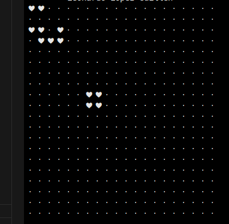

Conway's Game of Life

Result following the tutorial: https://realpython.com/conway-game-of-life-python/

This project needs Python 3.11

My addition to this tutorial is in patterns.py generate_pattern(), this simple function allows you to insert some string and generate a basic pattern based on it, better if you enter long ones, like your name :D

